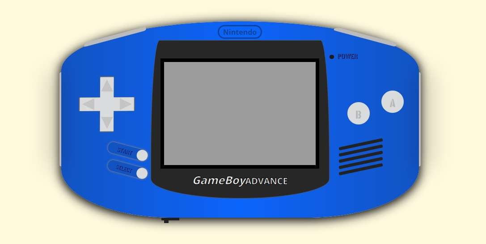
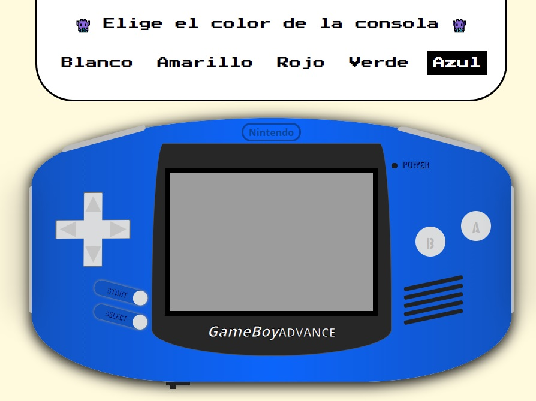
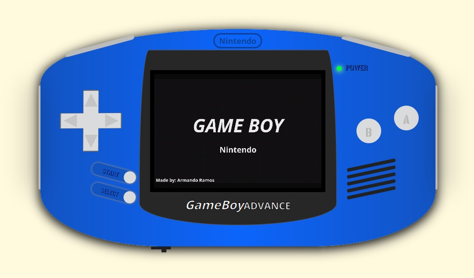
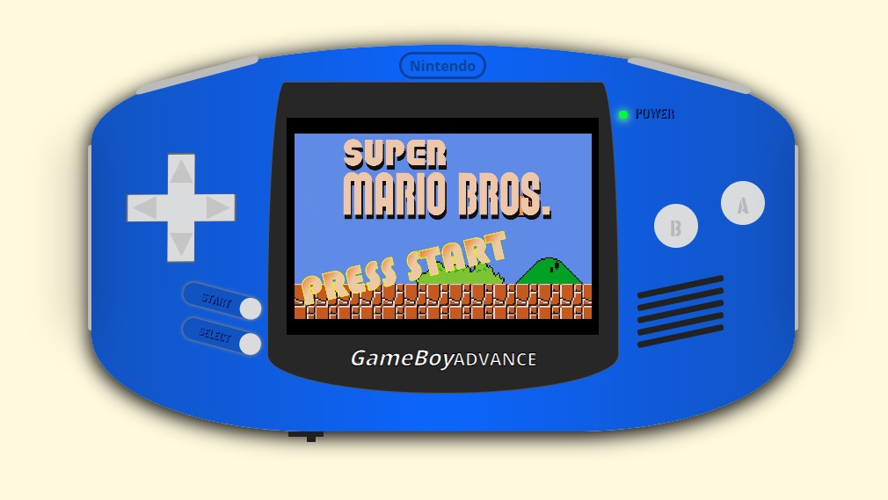
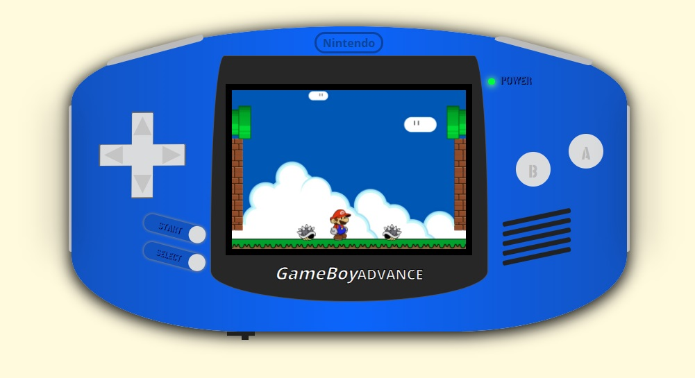
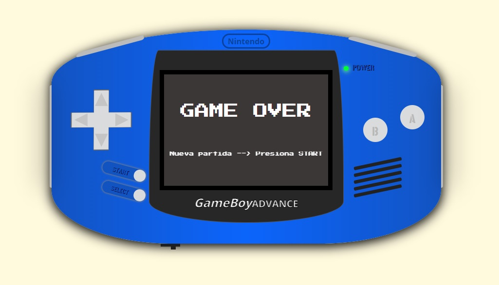

# Videoconsola CSS

## Proyecto realizado en GeeksHubs Academy con HTML, CSS y JS.
***
### Página web mostrando el dibujo de una Game Boy Advance (unicamente con HTML y CSS).

### También se ha añadido funcionalidad extra:

***
* Diseño de la consola totalmente responsive.
***

***
* Se puede cambiar el color de la consola con el menú desplegable que aparece en la parte superior de la pantalla.
***

***
* Se puede encender la consola pulsando el botón de abajo a la izquierda. Esto iniciará un vídeo de intro. Tras este vídeo se reproducirá otro en el que podemos pulsar el botón START de la consola para iniciar el juego (ambos vídeos creados con Davinci Resolve).
***

***
* Podemos jugar a una versión sencilla de Super Mario. El personaje puede moverse hacia los lados (pulsando las flechas izquierda y derecha de la consola o las teclas "a" y "d" del teclado, respectivamente), saltar en vertical (pulsando la flecha arriba de la consola o la tecla "w" del teclado) y saltar en diagonal (pulsando los botones B y A de la consola o las teclas "q" o "e" del teclado, respectivamente).

***

***
* Un contador indicará cuantos enemigos hemos superado
***
* Si algún enemigo nos toca saltará una pantalla de GAMEOVER, dándonos la posibilidad de volver al juego pulsando el botón START de la consola.
***

***
### 🎮 Puedes probarlo todo directamente desde tu navegador, desde la opción "Environments" que ofrece github. 🎮

### 🚀 ¡No dudes en colaborar si quieres mejorarlo! 🚀
